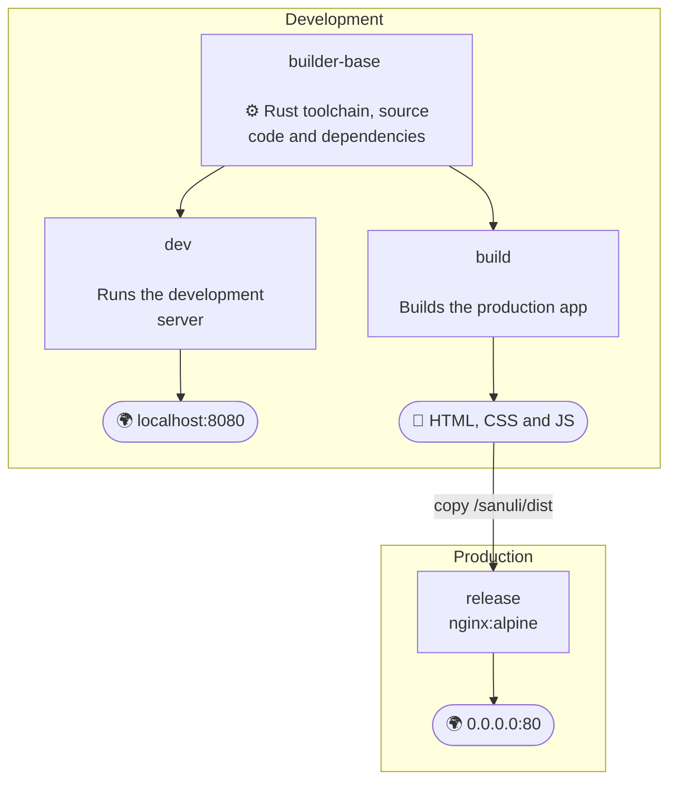

# Containerizing web applications with Docker

This exercise will guide you through the process of containerizing a web application using Docker. You will learn how to create a Dockerfile, build a Docker image, and run a container from that image.

We assume that you have completed previous exercises in this course and are familiar with basic concepts of Docker. This exercise itself is *not a tutorial*, but an exercise, where you are expected to apply the knowledge from other tutorials and documentation. You need to do your own research and read the documentation to complete the tasks. Discussing the tasks with your peers and instructors is highly encouraged.

The [Docker introduction (docker.com)](https://docs.docker.com/get-started/introduction/) provides a good introduction to Dockerfiles and how to use them. The blog post [How to Dockerize a React App (docker.com)](https://www.docker.com/blog/how-to-dockerize-react-app/) provides a very similar example, but for a React application. Although the technologies are different, the concepts and instructions are very similar, so you can apply the knowledge from that post to this exercise as well.


## Prerequisites

Before starting this exercise, you should have Docker either installed on your system or be using a cloud service that provides a Docker runtime environment. The default [GitHub Codespace](https://github.com/features/codespaces) environment comes with Docker pre-installed, which can be a very convenient solution. Verify that you can run the `docker` command in your terminal. You can check this by running the following command:

```bash
docker --help
```

If you see a list of Docker commands and options, you are ready to proceed. If not, please refer to the [Docker installation guide](https://docs.docker.com/get-docker/) for instructions on how to install Docker on your system or use a cloud service.

> [!NOTE]
> We recommend using a [GitHub Codespace](https://github.com/features/codespaces) or a [local development container](https://code.visualstudio.com/docs/devcontainers/containers) to complete this exercise. Local development containers may require additional configuration and setup, as they technically run Docker commands inside a Docker container. A GitHub Codespace will provide a ready-to-use environment with Docker pre-installed, which can save you time and effort.
>
> This project requires more resources than the default Codespace configuration. We recommend using 4 CPUs and 16 GB of RAM to avoid crashes and performance issues. These settings have also been configured in the [`.devcontainer/devcontainer.json` file](./.devcontainer/devcontainer.json), so they are applied automatically when you open the project in a Codespace.


## Sanuli

The application to be containerized this exercise is Sanuli, *"a finnish version of a popular word guessing game implemented in Rust."* [(Sanuli at GitHub)](https://github.com/Cadiac/sanuli) You can play the game online at [sanuli.fi](https://sanuli.fi/). We will not be modifying the application itself, but rather focus on creating a Dockerfile to build and run the application in a containerized environment.

> [!IMPORTANT]
> Although the game is [written in Rust](https://www.rust-lang.org/), **you do not need to know Rust nor install any Rust tools in your host system**.
>
> Instead, you will use [the Rust base image for Docker](https://hub.docker.com/_/rust) that contains the necessary tools to build and run the application. We will cover this in more detail later in the exercise.


## The Sanuli *submodule*

Sanuli has its own [Git repository](https://github.com/Cadiac/sanuli), which we have included as a [submodule](https://git-scm.com/book/en/v2/Git-Tools-Submodules) in this repository. This allows you to easily access the Sanuli code without needing to clone it separately. Initially, when you clone this repository, the submodule [/sanuli](./sanuli) will be empty. To populate it with the code from the upstream Sanuli repository, you need to initialize and update the submodule in the root of your repository. You can do this by running the following commands in the terminal:

```bash
git submodule init      # initialize the submodule
git submodule update    # fetch the latest code from the submodule repository
```

You will not need to make any changes in the Sanuli code. Reading the [Sanuli readme file](https://github.com/Cadiac/sanuli/blob/master/README.md) is enough to understand how to build and run the application. There are also instructions on how to prepare the word lists that the game uses, which we will cover later in the exercise.

If you want to learn more about Git submodules, we recommend watching the video [Git Submodules Tutorial (YouTube)](https://youtu.be/gSlXo2iLBro?si=Q_srt86bHf767323) or reading the [Git documentation on submodules](https://git-scm.com/book/en/v2/Git-Tools-Submodules). However, the two commands above are all you need in this exercise.


## Step 1: Running Sanuli in a container (manually)

Before automating a task, it is useful to understand how it works manually. In this phase, you will run the application in a container and learn which commands and files are needed. This will make it easier to create the Dockerfile in the next phase. It may be a good idea to take notes of the commands and files that you use, as you will need to use them in the Dockerfile later.

Running the application manually helps us understand the requirements and dependencies of the application. Start by creating a container from the [Rust base image](https://hub.docker.com/_/rust):

```bash
# Create an interacative container with the latest default Rust image.
# Add a port mapping and a name, but do not start it yet (create instead of run):
docker create -it --publish 127.0.0.1:8080:8080 --name sanuli-sandbox rust:latest
```

The Rust base image provides the tools needed to build and run the Sanuli application. Next, copy the Sanuli source code into the container and start the container, attaching to its terminal:

```bash
# Copy the Sanuli source code into the container:
docker cp sanuli sanuli-sandbox:/sanuli

# Start the container and attach to its terminal:
docker start sanuli-sandbox --attach --interactive
```

The previous steps should end up with a terminal in the container, where you can run commands as if you were in a regular Linux environment. The Sanuli source code should now be available in the `/sanuli` directory inside the container:

```bash
# In the container terminal, change to the Sanuli directory:
cd /sanuli

# List the copied files:
ls -la

# Read the readme for further quick start instructions:
cat README.md
```

Follow the quick start instructions from the [Sanuli readme file](https://github.com/Cadiac/sanuli/blob/master/README.md) to get the application running.

Now, you can try to get the Sanuli application running manually, following the quick start instructions.

> [!NOTE]
> One important note is that the development server listens only to the localhost interface by default, which means that the app is only accessible from the container itself. To allow connections from your host system (your browser), you need to specify the `--address` option when running the `trunk serve` command:
>
> ```bash
> # listens to all interfaces
> trunk serve --address 0.0.0.0
> ```
>
> You will likely encounter a few warnigns related to unused variables or unexpected conditions. These warnings are not errors, and they do not prevent the application from running.


If you encounter any other issues, it is recommended to resolve them before automating the process with a Dockerfile. You can stop the container by pressing `Ctrl+C` in the terminal, and you can remove it with the command:

```bash
docker rm sanuli-sandbox
```


## Step 2: Creating the Dockerfile

Assuming you have the Sanuli source code available and you succeeded in setting it up in a container, you can now automate the process by creating a Dockerfile.

This repository contains a [Dockerfile](./Dockerfile) that you will use to build the Docker image for Sanuli. As you already know, a Dockerfile is a text file that contains instructions for building a Docker image.

Docker images are the executable packages that contain everything needed to run an application, including the code, runtime, libraries, and dependencies. Images are based on base images, which provide the operating system and other necessary components. In this exercise, we recommend using the official [Rust base image](https://hub.docker.com/_/rust) as the base image.

The [Sanuli readme file](https://github.com/Cadiac/sanuli/blob/master/README.md) contains all the commands needed to build and run the application. The tools, which come pre-installed in the Rust base image, are:

* [`rustup` for toolchain management](https://www.rust-lang.org/tools/install).
* [`cargo` for package management](https://doc.rust-lang.org/cargo/).
* Sanuli also uses the [`trunk` web application bundler](https://github.com/trunk-rs/trunk), which is installed with `cargo`.

You don't need to install Rust or any of these tools, as the base image already contains them. However, the repository does not contain word lists, which we will cover later in the exercise.

To complete this part of the exercise, you will need to read the "quick start" instructions from the [readme file](https://github.com/Cadiac/sanuli/blob/master/README.md) and apply them in your Dockerfile. You will need to utilize the [`WORKDIR`, `COPY`, `RUN`, `EXPOSE` and `CMD` instructions](https://docs.docker.com/reference/dockerfile/), which are described in every Docker tutorial, and they are typically used very similarly regardless of the technology being used. Copying source code into the image, installing dependencies and building applications is very similar regardless of whether you are using Rust, Node.js, React, Java or any other technology.

We recommend referring to the [Dockerfile reference documentation](https://docs.docker.com/reference/dockerfile/) for a detailed explanation of each instruction. Consider when each instruction should be executed. For example, installing tools and dependencies should happen in the build phase using `RUN` instructions, while starting the development server should be done in the run phase using `CMD` (or `ENTRYPOINT`) instructions.


### Adding word lists

Sanuli uses a few word lists to provide words for the game, which are referred to in the [Sanuli readme file](https://github.com/Cadiac/sanuli/blob/master/README.md). The word lists are not included in the repository, so you will need to prepare them yourself.

For this exercise, the contents of the word lists are not very important, so you can create empty files or write a few five letter words in text files yourself. You can also familiarize yourself with the scripts in [sanuli/src/bin](https://github.com/Cadiac/sanuli/tree/master/src/bin) folder.

If you want, you can use the word lists provided by the [Institute for the Languages of Finland](https://kotus.fi/) (Kotimaisten kielten keskus). Their [Nykysuomen sanalista](https://kotus.fi/sanakirjat/kielitoimiston-sanakirja/nykysuomen-sana-aineistot/nykysuomen-sanalista/) can be downloaded and used according to the [license terms](https://creativecommons.org/licenses/by/4.0/deed.fi).

We have prepared a [fetch-words.sh](./fetch-words.sh) script that will download a word list and prepare it in a format that Sanuli can use. You can *copy the script into the container* and run it, before the application itself is built:

```dockerfile
# Copy the script for fetching words:
COPY fetch-words.sh ./

# Make the script executable:
RUN chmod +x fetch-words.sh

# Run the script to populate the required word files:
RUN ./fetch-words.sh
```

Please note that the URL and the format of the word list can change, so familiarize yourself with the script and the Kotus website to make sure everything works as expected:

> *"The list is updated in connection with updates to the Kielitoimisto dictionary, approximately every year or two, and other changes may also be made."*
>
> https://kotus.fi/sanakirjat/kielitoimiston-sanakirja/nykysuomen-sana-aineistot/nykysuomen-sanalista/


### Accepting connections from the host system

When running a web application in a Docker container, you need to ensure that the application is accessible from your host system. By default, the [`trunk` development server](https://trunk-rs.github.io/trunk/) listens only to the localhost interface, which means that the app is only accessible from the container itself. We need to change this to be able to access the app with our browser.

To allow connections from the host system (your browser), you need to [specify the `--address` option when running the `trunk serve` command](https://trunk-rs.github.io/trunk/guide/configuration/index.html#server-section) in the Dockerfile:

```dockerfile
# listens to all interfaces (0.0.0.0)
CMD ["trunk", "serve", "--address", "0.0.0.0"]
```

> [!NOTE]
> This setup is only required for the development server. In production, the application will be served by a separate web server, which will listen to all interfaces by default. This will be covered later in the "multi stage" section of the exercise.


## Step 3: Building the Docker image

Once you have completed some of the instructions in the Dockerfile, you can try building the Docker image. To do this, run the following command in the terminal from the root of your repository:

```bash
# run build in current folder "." and tag the image as "sanuli"
docker build --tag sanuli .
```

The first time you install the dependencies in the build phase, it can take a very long time. However, [Docker caches the layers of the image](https://docs.docker.com/build/cache/), so subsequent builds will be faster. It is a good practice to organize the instructions in the Dockerfile so that the layers that change less frequently or are slower to execute are placed earlier in the file.


## Step 4: Running the containerized application

Once the image is built, you can run the application in a container. As the app is a web application, you will need to expose the port on which the application is running. By default, Sanuli runs on port 8080, so you will need to map that port to a port on your host system. To do this, run the following command in the terminal:

```bash
# Run the container and map port 8080 in the container to port 8080 on the host.
# `--rm` option removes the container automatically after it is stopped.
docker run -it --rm --publish 127.0.0.1:8080:8080 sanuli
```

When the container is running, you can access the application in your web browser by navigating to http://localhost:8080. You should see the Sanuli game interface. If the connection is refused but there are no erros in the Docker logs, verify that you specified the server to listen to all interfaces by using the `--address` option in the `CMD` instruction of your Dockerfile, as described earlier.

> [!NOTE]
> Starting the application is likely produce a few warnings related to unused variables or unexpected conditions. These warnings are not errors, and they do not prevent the application from running.

If you get an error message about the port being in use, make sure that you have not already started an application on that port and that another Sanuli container is not already running in the background. You can check the running containers with the command `docker container ls` or `docker ps` and stop them with `docker container stop <container_id>`, if necessary.


## Step 5: Ignoring files with `.dockerignore`

The container seems to be running nicely, but there are some files in there that we would not like to copy into the container. Typically such files include local build artifacts or *node_modules* that are not needed in the container, *.env* files, which contain your local environment variables, and *.git* directories, that contain the version history of your project. In Sanuli's case, we would like to exclude the *README.md* file and the *.git* directory from the container.

Your task is to create a `.dockerignore` file to specify which files and directories should be ignored when building the Docker image. Add a new `.dockerignore` file alongside your Dockerfile and add specify the `README.md` file and the `.git` directory in it. Then add and commit your changes to the repository.

As the *README.md* file is in the subfolder, you can't just write the name `README.md` in the `.dockerignore` file. There are many ways you can refer to the file, either with a specific path (`path/to/file`) or a pattern (`**/file`). See the [Docker documentation on .dockerignore files](https://docs.docker.com/build/concepts/context/#dockerignore-files) for options on how to exclude files.

Also, note that these exercise instructions are in the root `readme.md` file, which is different from the `README.md` file in the *sanuli* subfolder.


## Step 6: multi stage Dockerfile

As you have likely noticed at this point, building the Sanuli application requires quite a bunch of tools and dependencies and it can be slow to start. Use `docker image ls` to list the images on your system and see how large the Sanuli image is before any optimizations. The size of the image is expected to be over 2 gigabytes, which is quite large for this relatively simple web application.

**Development vs. production build**

To this point, we have been utilizing Rust development tools and the Trunk development server, but in production, none of these tools will be required. When publishing the app, only the compiled source code and static files (word lists, images etc.) are needed. All of these can be served to the clients as static files. Refer to the Sanuli readme section for ["Release build"](https://github.com/Cadiac/sanuli#release-build), which explains the single command, that produces a small production package of the application.

The size of our production image should therefore be measured in megabytes, not gigabytes. To reduce the size, we can use [multi-stage builds](https://docs.docker.com/build/building/multi-stage/) in the Dockerfile.

**Multi-stage build**

Familiarize yourself with multi-stage builds using [videos](https://www.youtube.com/results?search_query=docker+multi+stage+build), [tutorials](https://www.google.com/search?q=docker+multi+stage+build) and [articles](https://www.docker.com/blog/how-to-dockerize-react-app/) of your choice. When you have a rough understanding of the concept, you can start modifying your Dockerfile to create a multi-stage build.

The following illustration explains the idea of how to structure the Dockerfile using multi-stage builds. The file may appear complex at first, but luckily it will not require many changes compared to the previous version.



The first stages, `builder-base` and `dev`, are the ones that correspond to the previous parts of the exercise, which you have already completed. The new stages, `build` and `release`, first build the production artifacts (html, css, js and other static files) and then serve them using a lightweight [nginx image](https://hub.docker.com/_/nginx). Note that the `release` stage does not include any of the Rust tools nor the development server. This is the key to reducing the size of the final image to just megabytes and to starting the production server in an instant.

To complete this part of the exercise, you will need to modify your Dockerfile to implement the multi-stage build. Feel free to use Dockerfile example below and modify it to match your previous solution. You should only need to make changes in the `builder-base` and `dev` stages, which the `build` and `release` stages depend on. You are free to modify all stages, but keep the names of the stages as they ared, as they are used in automated grading.

If you have a working Dockerfile from the previous steps, you will only need to move the existing instructions to the correct stages to complete this final modification to the Dockerfile. We have added `TODO` comments in the example Dockerfile below to help you identify which instructions need to be moved to the `builder-base` stage and which instructions need to be moved to the `dev` stage.


```dockerfile
FROM rust:latest AS builder-base
# This base step should have the instructions that are required by other stages,
# such as installing dependencies.
#
# TODO: Move your previous COPY, RUN and WORKDIR instructions here, so they are completed
# before the next stages. If the WORKDIR is set to something other than `/sanuli`,
# make sure to update the COPY instruction in the release stage below to match.
#
# You can leave out the CMD instruction, as this stage is not meant to produce a
# runnable application, but to prepare a reusable environment.


FROM builder-base AS dev
# This stage is used for development, and it uses the previous builder-base as its
# base, so the code and dependencies are already in place.
#
# TODO: add the CMD and EXPOSE instructions from your initial solution to expose
# the port and to start the development server.


FROM builder-base AS build
# In this stage, we will build the production artifacts. The stage uses the
# same base as the dev stage, so the environment should be ready. You should
# not need to modify this stage, as we already added the build command from
# the Sanuli readme file:
#
ENV RUSTFLAGS="--cfg=web_sys_unstable_apis --remap-path-prefix \$HOME=~"
RUN trunk build --release
#
# No CMD instruction is needed here, as there is no need to run a container
# from this stage. Instead, we will copy and serve the built artifacts from
# this stage in the next stage.


FROM nginx:alpine AS release
# This is the final stage, which uses the nginx base image to serve the built app.
# See https://hub.docker.com/_/nginx for information about the nginx base image.
#
# You should not need to modify this stage.
#
# Note that this stage is not based on the previous stages, which produced very
# large images containing the Rust toolchain and development server. Instead, it
# is based on a lightweight nginx image, which has nothing to do with Rust or
# the previous development tools. This is the key to reducing the size of the
# final image to just megabytes.
#
# We can now copy the artifacts from the `build` stage to the public directory of nginx:
COPY --from=build /sanuli/dist /usr/share/nginx/html
#
# Nginx listens to port 80 by default, so we expose that port:
EXPOSE 80
#
# A CMD instruction is not needed here, as the nginx base image already has a CMD,
# which will be inherited. The nginx server will start when this container is run.
```

After these changes, you can build different images for development and production purposes. The development image will contain the Rust toolchain and the development server, while the production image will only contain the built static files and an nginx web server to serve them to clients.


## Step 7: Building and running the multi-stage Dockerfile

From now on, you can specify which stage you want to build by using the `--target` option in the `docker build` command. For example, to build the stage named as `dev` in the Dockerfile, you can run:

```bash
# build the `dev` stage as target and tag the image as sanuli-dev:
docker build --target dev --tag sanuli-dev .

# run the development image in a container like before:
docker run --rm --publish 127.0.0.1:8080:8080 sanuli-dev

# then, visit http://localhost:8080 in your browser
```

To build the production image, set the target to `release`, as specified in the last stage in the Dockerfile:

```bash
# build the `release` stage and tag it as sanuli:
docker build --target release --tag sanuli .

# now, run the production image, but map the local port to port 80 in the container:
docker run --rm --publish 127.0.0.1:80:80 sanuli

# then, visit http://localhost in your browser
```

The production image should now start in an instant and nginx should start several processes to serve the files efficiently to a large number of users. Verify that the application is running by visiting http://localhost in your web browser. If you are not able to start the production image on port 80, it may be because you do not have the necessary permissions to bind to ports below 1024. In that case, you can map the container's port 80 to a higher port on your host system, such as 8080:

```bash
docker run --rm --publish 127.0.0.1:8080:80 sanuli
# visit http://localhost:8080 in your browser
```

Last, check the sizes of your images using the `docker image ls` command. The development image should still be very large, while the production image should be much smaller, measured in megabytes.

```bash
docker image ls
```


## Submitting your work

Add, commit and push your solutions to your repository to invoke the automated grading. You can and should commit your solutions after each step to keep track of your progress and to make it easier to debug any issues that may arise. The automated grading will check your solutions and provide feedback on your progress.

Automated grading is implemented using GitHub actions. After each commit, you can see the autograding results as well as each test and their outputs in the *actions* tab under autograding Workflow. You can push new solutions as many times as necessary until the deadline of the exercise.


## Optional: remove the container(s) and image(s)

Although Sanuli is a simple web app, its container can be 2 gigabytes in size, so it is a good idea to remove the container and image after you have completed the exercise. This will free up disk space on your system.

Use the commands `docker container ls --all` and `docker image ls` to list all containers and images that you have used in this exercise. You will need to stop and remove containers before you can remove the images. To remove a container, use the `docker container rm` command, and to remove an image, use the `docker image rm` command.

* [`docker container` documentation](https://docs.docker.com/reference/cli/docker/container/)
* [`docker image` documentation](https://docs.docker.com/reference/cli/docker/image/)


## Licenses

This exercise would not be possible without the work of others. We are grateful for the open source and open data communities for providing the tools and resources that make this exercise possible.


### Sanuli

Sanuli is created by [Jaakko Husso](https://github.com/Cadiac) and licensed under the [MIT license](https://github.com/Cadiac/sanuli/blob/master/LICENSE).


### Word list by the institute for the languages of Finland (Kotimaisten kielten keskus)

The word list typically used in the Sanuli game is a Finnish word list provided by the [Kotimaisten kielten keskus](https://kotus.fi/), the Institute for the Languages of Finland.

At the time of writing, the word list is licensed under the [Creative Commons Attribution 4.0 International (CC BY 4.0)](https://creativecommons.org/licenses/by/4.0/deed.fi) license. See [kotus.fi](https://kotus.fi/sanakirjat/kielitoimiston-sanakirja/nykysuomen-sana-aineistot/nykysuomen-sanalista/) for up-to-date information.


### About the exercise

This exercise has been created by Teemu Havulinna and is licensed under the [Creative Commons BY-NC-SA license](https://creativecommons.org/licenses/by-nc-sa/4.0/).

AI tools such as ChatGPT and GitHub Copilot have been used in the implementation of the task description, source code, data files and tests.
